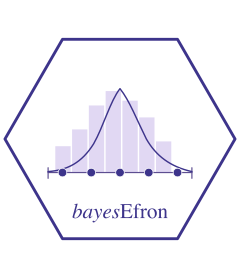

# bayesEfron 

<!-- badges: start -->
[](https://github.com/joonho112/bayesEfron/actions/workflows/R-CMD-check.yaml)
[](https://opensource.org/licenses/MIT)
<!-- badges: end -->

A meta-analysis or a multisite trial gives an estimate and a standard error
for each site. The usual random-effects model assumes that the true effects
behind the estimates follow a normal distribution. bayesEfron fits the same
model without that assumption. It estimates the distribution of true
effects, which may be skewed or have more than one peak, together with the
effect of each site. The distribution is represented by Efron's log-spline
family and the model is fully Bayesian, so that the intervals for the site
effects include the uncertainty about the distribution
([Lee and Sui, 2025](https://doi.org/10.3390/math13162639)).

## Installation

The package is installed from GitHub.

```r
# install.packages("remotes")
remotes::install_github("joonho112/bayesEfron")
```

The vignettes are on the
[package website](https://joonho112.github.io/bayesEfron/). To install them
with the package, install knitr and rmarkdown, make sure that Pandoc is
available (RStudio includes it), and add `build_vignettes = TRUE` to the
call above.

Fitting a model also needs the cmdstanr package and CmdStan, neither of
which is on CRAN.

```r
install.packages("cmdstanr",
                 repos = c("https://stan-dev.r-universe.dev", getOption("repos")))
cmdstanr::install_cmdstan()
```

CmdStan is built from source and needs a C++ toolchain;
`cmdstanr::check_cmdstan_toolchain()` says whether one is present, and the
[cmdstanr documentation](https://mc-stan.org/cmdstanr/articles/cmdstanr.html)
describes the setup for each operating system. The examples and vignettes of
bayesEfron run without CmdStan.

## Example

`raudenbush1985` holds the results of 19 experiments on the effect of
teachers' expectations on their pupils' IQ scores.

```r
library(bayesEfron)

fit <- bayes_efron_fit(
  theta_hat = raudenbush1985$yi,   # the estimates
  sigma = raudenbush1985$sei,      # their standard errors
  seed = 1985
)
```

The first call compiles the Stan model, which can take up to a minute. The
result of this call is stored in the package as `raudenbush_fit`, so the
lines below run without CmdStan.

```r
fit <- raudenbush_fit
summary(fit)               # the distribution of effects and each study's effect
confint(fit, type = "g")   # mean and standard deviation of the distribution
plot(fit, type = "g")      # the estimated distribution
plot(fit)                  # the effect of each study, with intervals
diagnose(fit)              # convergence diagnostics
```

With as few studies as these, the result for a study whose estimate is
extreme and imprecise can depend on the width of the grid and on the number
of spline functions. `vignette("choosing-a-grid")` shows how far it does
for study 4 of this example, and such a result should be compared over a
few specifications before it is reported.

## Documentation

`vignette("bayesEfron")` goes through this example.
`vignette("choosing-a-grid")` and `vignette("diagnostics")` cover the
choices and the checks that go with a fit, and `vignette("model")` states
the model. The reference and all vignettes are at
<https://joonho112.github.io/bayesEfron/>.

## Citation

To cite the package, cite the paper, as `citation("bayesEfron")` shows:

> Lee, J. and Sui, D. (2025). Fully Bayesian inference for meta-analytic
> deconvolution using Efron's log-spline prior. *Mathematics*, 13(16), 2639.
> <https://doi.org/10.3390/math13162639>

## Funding

This research was supported by the Institute of Education Sciences, U.S.
Department of Education, through Grant R305D240078 to the University of
Alabama. The opinions expressed are those of the authors and do not
represent views of the Institute or the U.S. Department of Education.
